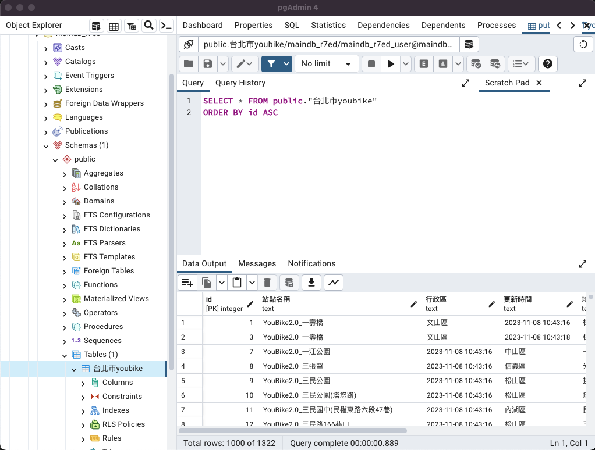

```
import psycopg2
import csv
import password as pw

conn = psycopg2.connect(database=pw.DATABASE,
                        user=pw.USER, 
                        password=pw.PASSWORD,
                        host=pw.HOST, 
                        port="5432")

cur = conn.cursor()
sql = '''
DELETE FROM 台北市youbike
'''
# open a file in the downloads folder
with open('./youbike.csv', 'r') as f:
    # Create a CSV reader
    reader = csv.reader(f)
    for row in reader:
        cur.execute("INSERT INTO 台北市youbike (站點名稱,行政區,更新時間,地址,總車輛數,可借,可還) VALUES (%s, %s, %s, %s, %s, %s, %s)",row)
    
conn.commit()
# cur.close()
# conn.close()
```